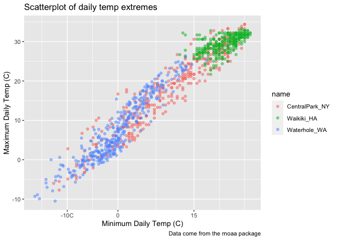
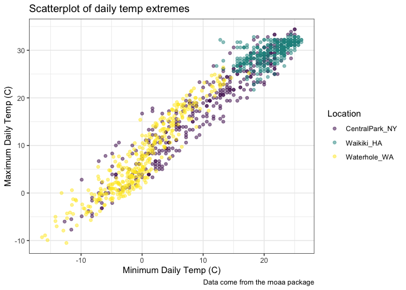
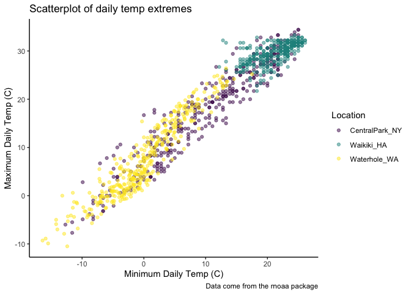
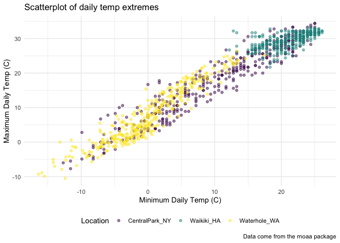

viz_part_2
================
Gabriela Jackson

    ## ── Attaching packages ─────────────────────────────────────── tidyverse 1.3.2 ──
    ## ✔ ggplot2 3.3.5     ✔ purrr   0.3.4
    ## ✔ tibble  3.1.6     ✔ dplyr   1.0.7
    ## ✔ tidyr   1.1.4     ✔ stringr 1.4.0
    ## ✔ readr   2.1.1     ✔ forcats 0.5.1
    ## ── Conflicts ────────────────────────────────────────── tidyverse_conflicts() ──
    ## ✖ dplyr::filter() masks stats::filter()
    ## ✖ dplyr::lag()    masks stats::lag()

# Section 1

Code copied from course website. Load NOAA dataset.

``` r
weather_df = 
  rnoaa::meteo_pull_monitors(
    c("USW00094728", "USC00519397", "USS0023B17S"),
    var = c("PRCP", "TMIN", "TMAX"), 
    date_min = "2017-01-01",
    date_max = "2017-12-31") %>%
  mutate(
    name = recode(
      id, 
      USW00094728 = "CentralPark_NY", 
      USC00519397 = "Waikiki_HA",
      USS0023B17S = "Waterhole_WA"),
    tmin = tmin / 10,
    tmax = tmax / 10) %>%
  select(name, id, everything())
```

    ## Registered S3 method overwritten by 'hoardr':
    ##   method           from
    ##   print.cache_info httr

    ## using cached file: ~/Library/Caches/R/noaa_ghcnd/USW00094728.dly

    ## date created (size, mb): 2022-03-22 14:09:21 (7.641)

    ## file min/max dates: 1869-01-01 / 2022-03-31

    ## using cached file: ~/Library/Caches/R/noaa_ghcnd/USC00519397.dly

    ## date created (size, mb): 2022-09-29 10:32:17 (1.699)

    ## file min/max dates: 1965-01-01 / 2020-03-31

    ## using cached file: ~/Library/Caches/R/noaa_ghcnd/USS0023B17S.dly

    ## date created (size, mb): 2022-09-29 10:32:19 (0.95)

    ## file min/max dates: 1999-09-01 / 2022-09-30

\##Scatterplot but better this time

``` r
weather_df %>% 
  ggplot(aes(x = tmin, y = tmax, color = name)) +
  geom_point(alpha = .5) +
  labs(
    x = "Minimum Daily Temp (C)",
    y = "Maximum Daily Temp (C)", 
    title = "Scatterplot of daily temp extremes",
    caption = "Data come from the rnoaa package"
  ) +
  scale_x_continuous(
    breaks = c(-10, 0, 15),
    labels = c("-10C", "0", "15")
  )
```

    ## Warning: Removed 15 rows containing missing values (geom_point).

<!-- -->

``` r
   #scale_y_continuous(
    #trans = "sqrt")
```

Make a new version

``` r
ggp_weather = weather_df %>% 
  ggplot(aes(x = tmin, y = tmax, color = name)) +
  geom_point(alpha = .5) +
  labs(
    x = "Minimum Daily Temp (C)",
    y = "Maximum Daily Temp (C)", 
    title = "Scatterplot of daily temp extremes",
    caption = "Data come from the rnoaa package"
  ) +
  viridis::scale_color_viridis(
    name = "Location",
    discrete = TRUE)
```

Can use scale_color_hue instead, but viridis color pallete is better.

scale_color_hue( name = “Location”, h = c(100, 300))

## Themes

``` r
ggp_weather +
  theme_bw() #instead of grey background
```

    ## Warning: Removed 15 rows containing missing values (geom_point).

<!-- -->

``` r
ggp_weather +
  theme_classic() #gets rid of gridlines
```

    ## Warning: Removed 15 rows containing missing values (geom_point).

<!-- -->

``` r
ggp_weather + 
  theme_minimal() + #gridlines but no outline box 
  theme(legend.position = "bottom") #if you switch the order, theme minimal will override the legend position
```

    ## Warning: Removed 15 rows containing missing values (geom_point).

<!-- --> \##
Setting options (as first code chunk)

library(tidyverse)

knitr::opts_chunk\$set( fig.width = 6, fig.asp = .6, out.width = “90%” )

theme_set(theme_minimal() + theme(legend.position = “bottom”))

options( ggplot2.continuous.colour = “viridis”, ggplot2.continuous.fill
= “viridis” )

scale_colour_discrete = scale_colour_viridis_d scale_fill_discrete =
scale_fill_viridis_d
